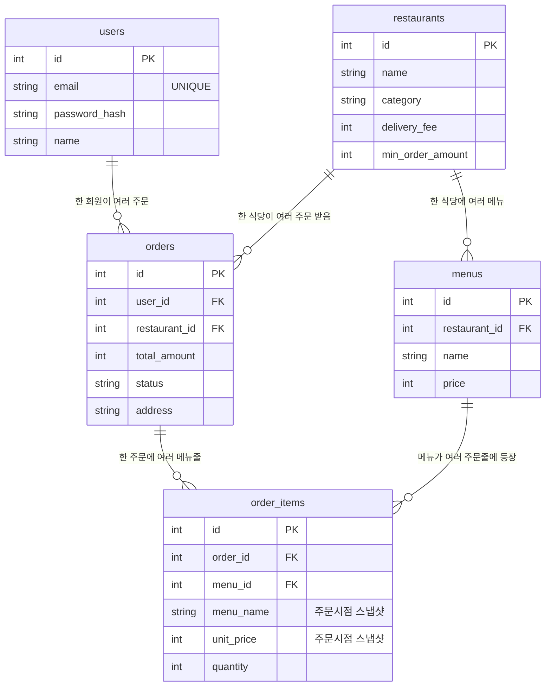

# DB 구조도 (ERD)

> 영상 ②(DB 구조 설명)·문서의 근거 자료. **테이블이 왜 이렇게 나뉘는지**를 본인 말로 설명할 수 있어야 A.

## 1. 테이블 관계도

## 2. 테이블 한 줄 설명
| 테이블 | 한 줄 설명 |
|---|---|
| **users** | 회원. 이메일(중복 불가)·비밀번호 해시·이름 저장. |
| **restaurants** | 식당. 이름·카테고리·배달비·최소주문금액 등. |
| **menus** | 메뉴. 어느 식당 소속인지(`restaurant_id`)와 가격. (식당 1 : N 메뉴) |
| **orders** | **주문 헤더.** "한 번의 주문" 1건 = 1행. 누가(`user_id`)·어디서(`restaurant_id`)·총액·상태·주소. |
| **order_items** | **주문 상세.** 그 주문에 담긴 메뉴를 줄 단위로 저장. (주문 1 : N 메뉴줄) |

## 3. ★ 왜 이렇게 나눴나 (핵심)

### (1) `orders` 와 `order_items` 를 나눈 이유 — 1:N 관계
한 번 주문할 때 메뉴를 여러 개 담는다(치킨 + 콜라 …). 즉 **주문 1건에 메뉴 N줄**이 붙는 1:N 관계다.
이를 한 테이블에 담으면 한 행에 메뉴를 몇 개까지 넣을지 정할 수 없고(가변 개수), 같은 주소·총액을 메뉴마다 반복 저장해야 한다.
그래서 **변하지 않는 주문 공통 정보는 `orders` 1행**에, **개수가 가변인 메뉴 목록은 `order_items` N행**으로 분리한다(정규화).

### (2) `order_items` 에 이름·가격을 "스냅샷"으로 저장한 이유
`order_items` 는 `menu_id` 로 메뉴를 가리키면서도, **주문 당시의 `menu_name` 과 `unit_price` 를 따로 복사해 둔다.**
→ 나중에 사장님이 메뉴 가격을 올리거나 이름을 바꿔도 **과거 주문 내역의 금액은 그대로 보존**된다.
(만약 항상 `menus` 를 조인해서 현재 가격을 보여주면, 과거 영수증 금액이 바뀌어 버린다.)

### (3) 장바구니는 왜 DB에 없나
장바구니는 결제 전까지 계속 바뀌는 **휘발성** 데이터다. 그래서 DB가 아니라 **브라우저(localStorage)** 에 두고,
**주문 확정 버튼을 눌렀을 때만** `orders` + `order_items` 로 영속화한다.

### (4) 외래키(FK)로 무결성 보장
`menus.restaurant_id`, `orders.user_id`, `order_items.order_id` 등 FK로 연결해
존재하지 않는 식당/회원/주문에 데이터가 붙는 것을 막는다.

## 4. 주문하면 데이터가 어디에 쌓이나 (데이터 흐름)
1. **회원가입** → `users` 에 1행.
2. **주문하기** 한 번 → 트랜잭션 안에서
   - `orders` 에 **1행**(총액·상태 `received`·주소)
   - `order_items` 에 담은 메뉴 수만큼 **N행**(메뉴명·단가 스냅샷·수량)
   - 둘 다 성공해야 `COMMIT`, 하나라도 실패하면 `ROLLBACK`(중간에 끊긴 주문이 남지 않음).
3. **내 주문 내역** → `orders` 를 `user_id` 로 조회하고 각 주문의 `order_items` 를 함께 보여준다.
