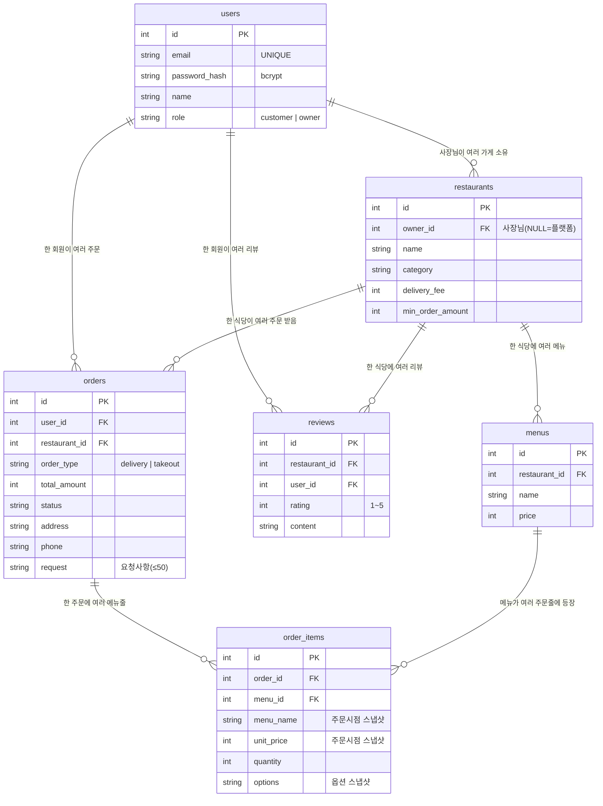

# DB 구조도 (ERD)

> 영상 ②(DB 구조 설명)·문서의 근거 자료. **테이블이 왜 이렇게 나뉘는지**를 본인 말로 설명할 수 있어야 A.

## 1. 테이블 관계도

## 2. 테이블 한 줄 설명
| 테이블 | 한 줄 설명 |
|---|---|
| **users** | 회원. 이메일(중복 불가)·비밀번호 해시·이름·**역할(손님/사장님)**. |
| **restaurants** | 식당. `owner_id` 로 등록 사장님 연결(NULL=시드/플랫폼 제공). |
| **menus** | 메뉴. 어느 식당 소속(`restaurant_id`)·가격. (식당 1 : N 메뉴) |
| **orders** | **주문 헤더.** 한 번의 주문 = 1행. 누가·어디서·**배달/포장**·총액·상태·주소·연락처·요청사항. |
| **order_items** | **주문 상세.** 그 주문의 메뉴를 줄 단위로. 이름·단가·**옵션**을 주문시점 값으로 스냅샷. |
| **reviews** | 리뷰. 손님이 식당에 남긴 별점(1~5)+내용. |

## 3. ★ 왜 이렇게 나눴나 (핵심)

### (1) `orders` 와 `order_items` 를 나눈 이유 — 1:N 관계
한 번 주문에 메뉴를 여러 개 담는다(치킨 + 콜라 …). 즉 **주문 1건에 메뉴 N줄**의 1:N 관계다.
한 테이블에 담으면 메뉴 개수가 가변이라 표현이 어렵고, 주소·총액을 메뉴마다 중복 저장해야 한다.
그래서 **공통 정보는 `orders` 1행**, **가변 목록은 `order_items` N행**으로 분리한다(정규화).

### (2) `order_items` 에 이름·가격·옵션을 "스냅샷"으로 저장한 이유
`menu_id` 로 메뉴를 가리키면서도 주문 당시의 `menu_name`·`unit_price`·`options` 를 **복사**해 둔다.
→ 나중에 사장님이 가격을 올리거나 메뉴를 바꿔도 **과거 주문 내역은 그대로 보존**된다.

### (3) `users.role` 로 손님/사장님을 한 테이블에서 구분
별도 사장님 테이블 대신 `role` 컬럼으로 구분해 단순화. `restaurants.owner_id` 가 사장님(users.id)을 가리켜
"이 가게는 누구 것"인지 표현한다(사장님 1 : N 가게).

### (4) 장바구니는 왜 DB에 없나
장바구니는 결제 전까지 바뀌는 **휘발성** 데이터 → 브라우저(localStorage). **주문 확정 시에만** orders/order_items 로 영속화.

### (5) 외래키(FK)로 무결성 보장
`menus.restaurant_id`, `orders.user_id`, `order_items.order_id`, `reviews.restaurant_id` 등 FK로
존재하지 않는 식당/회원/주문에 데이터가 붙는 것을 막는다.

## 4. 주문하면 데이터가 어디에 쌓이나 (데이터 흐름)
1. **회원가입** → `users` 1행 (role 포함).
2. **사장님 가게/메뉴 등록** → `restaurants`(owner_id=나) / `menus`.
3. **주문하기** 한 번 → 트랜잭션 안에서
   - `orders` 1행 (배달/포장·총액·주소·연락처·요청사항)
   - `order_items` 담은 메뉴 수만큼 N행 (이름·단가·옵션 스냅샷)
   - 둘 다 성공해야 `COMMIT`, 실패 시 `ROLLBACK`.
4. **리뷰 작성** → `reviews` 1행.
5. **내 주문 내역** → `orders`(user_id) + 각 `order_items` 조회.
